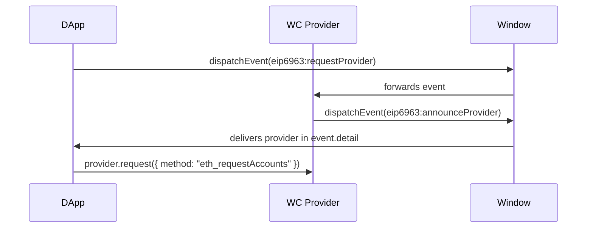

# WalletConnect EIP-6963 Integration Plan

## Overview

This plan outlines how to integrate WalletConnect using **EIP-6963** (Multi Provider Discovery). This approach announces the WalletConnect provider to the window, allowing other dApps and wallets to discover it via the standard EIP-6963 events.

This is useful if you want to:
- Be discoverable by other dApps
- Follow the EIP-6963 standard for wallet discovery
- Have a more "injected provider" like experience

## Package to Use

**`@walletconnect/ethereum-provider`** - Same as the standard approach, but we'll wrap it with EIP-6963 event handling.

## Installation

```bash
npm install @walletconnect/ethereum-provider
```

---

## Integration Steps

### Step 1: Get WalletConnect Project ID

1. Go to [WalletConnect Cloud](https://cloud.walletconnect.com)
2. Create a new project
3. Copy the Project ID

---

### Step 2: Initialize the Provider and Announce via EIP-6963

EIP-6963 uses two events:
- `eip6963:requestProvider` - Fired by dApps/wallets to request available providers
- `eip6963:announceProvider` - Fired by providers to announce themselves

Here's how to implement it:

```typescript
import { EthereumProvider } from "@walletconnect/ethereum-provider";

// 1. Initialize the provider
const provider = await EthereumProvider.init({
  projectId: "YOUR_PROJECT_ID",
  optionalChains: [1, 10, 137, 42161],
  showQrModal: false, // We'll handle QR ourselves via EIP-6963
  metadata: {
    name: "Your App Name",
    description: "Description of your app",
    url: "https://your-app.com",
    icons: ["https://your-app.com/icon.png"]
  }
});

// 2. EIP-6963 Provider Info
const EIP6963Info = {
  rdns: "com.walletconnect",
  name: "WalletConnect",
  description: "Connect to WalletConnect-compatible wallets",
  url: "https://walletconnect.com",
  icons: ["https://walletconnect.com/walletconnect-logo.png"]
};

// 3. Listen for EIP-6963 requestProvider event
// This allows other dApps to discover this provider
window.addEventListener("eip6963:requestProvider", () => {
  window.dispatchEvent(
    new CustomEvent("eip6963:announceProvider", {
      detail: {
        info: EIP6963Info,
        provider: provider  // The EthereumProvider instance
      }
    })
  );
});

// 4. Also emit on init so already-loaded scripts can get the provider
window.dispatchEvent(
  new CustomEvent("eip6963:announceProvider", {
    detail: {
      info: EIP6963Info,
      provider: provider
    }
  })
);
```

---

### Step 3: Connect and Handle QR

Since we set `showQrModal: false`, we need to handle the connection URI ourselves:

```typescript
// Listen for the connection URI
provider.on("display_uri", (uri: string) => {
  // Generate QR code from URI
  // Use any QR library: qrcode, qrcode.react, etc.
  console.log("WalletConnect URI:", uri);
  // QRCode.toCanvas(canvas, uri);
});

await provider.connect();
```

---

### Step 4: Full EIP-6963 Provider Module

Create a reusable module that wraps everything:

```typescript
// src/walletconnect-provider.ts
import { EthereumProvider } from "@walletconnect/ethereum-provider";

export interface WalletConnectEIP6963Config {
  projectId: string;
  chains?: number[];
  optionalChains?: number[];
  metadata?: {
    name: string;
    description: string;
    url: string;
    icons: string[];
  };
}

let providerInstance: EthereumProvider | null = null;

export async function initWalletConnectProvider(
  config: WalletConnectEIP6963Config
): Promise<EthereumProvider> {
  if (providerInstance) {
    return providerInstance;
  }

  providerInstance = await EthereumProvider.init({
    projectId: config.projectId,
    chains: config.chains,
    optionalChains: config.optionalChains,
    showQrModal: false, // We'll use EIP-6963 instead
    metadata: config.metadata
  });

  // EIP-6963 Provider Info
  const providerInfo = {
    rdns: "com.walletconnect",
    name: config.metadata?.name || "WalletConnect",
    description: config.metadata?.description || "Connect to WalletConnect-compatible wallets",
    url: config.metadata?.url || "https://walletconnect.com",
    icons: config.metadata?.icons || ["https://walletconnect.com/walletconnect-logo.png"]
  };

  // Announce provider when requested via EIP-6963
  window.addEventListener("eip6963:requestProvider", () => {
    window.dispatchEvent(
      new CustomEvent("eip6963:announceProvider", {
        detail: {
          info: providerInfo,
          provider: providerInstance!
        }
      })
    );
  });

  // Also announce immediately (for scripts already loaded)
  window.dispatchEvent(
    new CustomEvent("eip6963:announceProvider", {
      detail: {
        info: providerInfo,
        provider: providerInstance!
      }
    })
  );

  return providerInstance;
}

// Utility: Discover WalletConnect via EIP-6963 (for dApps)
export function discoverWalletConnectProvider(): Promise<EthereumProvider | null> {
  return new Promise((resolve) => {
    // Check if already announced
    const checkProviders = () => {
      const event = new CustomEvent("eip6963:requestProvider");
      window.dispatchEvent(event);
    };

    // Listen for announcement
    const handleAnnounce = (event: Event) => {
      const detail = (event as CustomEvent).detail;
      if (detail?.info?.rdns === "com.walletconnect") {
        window.removeEventListener("eip6963:announceProvider", handleAnnounce);
        resolve(detail.provider as EthereumProvider);
      }
    };

    window.addEventListener("eip6963:announceProvider", handleAnnounce);

    // Request providers
    checkProviders();

    // Timeout after 5 seconds
    setTimeout(() => {
      window.removeEventListener("eip6963:announceProvider", handleAnnounce);
      resolve(null);
    }, 5000);
  });
}
```

---

### Step 5: Usage in Your App

```typescript
// Initialize and connect
import { initWalletConnectProvider } from "./walletconnect-provider";

const provider = await initWalletConnectProvider({
  projectId: "YOUR_PROJECT_ID",
  optionalChains: [1, 10, 137, 42161],
  metadata: {
    name: "My DApp",
    description: "My decentralized application",
    url: "https://myapp.com",
    icons: ["https://myapp.com/icon.png"]
  }
});

// Listen for QR URI
provider.on("display_uri", (uri) => {
  // Generate QR code
});

// Connect
await provider.connect();

// Make requests
const accounts = await provider.request({ method: "eth_requestAccounts" });
```

---

## How EIP-6963 Discovery Works



---

## Alternative: Discover Other EIP-6963 Providers

If you want your dApp to discover other EIP-6963 compatible wallets (not just WalletConnect):

```typescript
function discoverEIP6963Providers(): Array<{ info: any; provider: any }> {
  const providers: Array<{ info: any; provider: any }> = [];

  const handleAnnounce = (event: Event) => {
    const detail = (event as CustomEvent).detail;
    if (detail?.info && detail?.provider) {
      providers.push({ info: detail.info, provider: detail.provider });
    }
  };

  window.addEventListener("eip6963:announceProvider", handleAnnounce);

  // Request all providers
  window.dispatchEvent(new CustomEvent("eip6963:requestProvider"));

  // Cleanup after 5 seconds
  setTimeout(() => {
    window.removeEventListener("eip6963:announceProvider", handleAnnounce);
  }, 5000);

  return providers;
}

// Usage
const providers = discoverEIP6963Providers();
// providers[0].info.rdns === "com.walletconnect"
// providers[0].info.rdns === "io.metamask"
// etc.
```

---

## Comparison: Standard vs EIP-6963

| Feature | Standard Approach | EIP-6963 Approach |
|---------|------------------|-------------------|
| QR Code Modal | Built-in (via @reown/appkit) | Handle yourself or use @reown/appkit |
| Provider Discovery | Only your app uses it | Other dApps can discover it |
| Standard Compliance | Uses window.ethereum | Uses EIP-6963 events |
| Injected Provider | No | Yes (via announceProvider) |
| Use Case | Single dApp | Multi-dApp / Wallet integration |

---

## Next Steps for Your Project

1. Install `@walletconnect/ethereum-provider`
2. Get a Project ID from [WalletConnect Cloud](https://cloud.walletconnect.com)
3. Create the EIP-6963 provider module (see Step 4)
4. Initialize the provider and announce via EIP-6963 events
5. Handle QR code display via `display_uri` event
6. Test with multiple wallets and dApps
