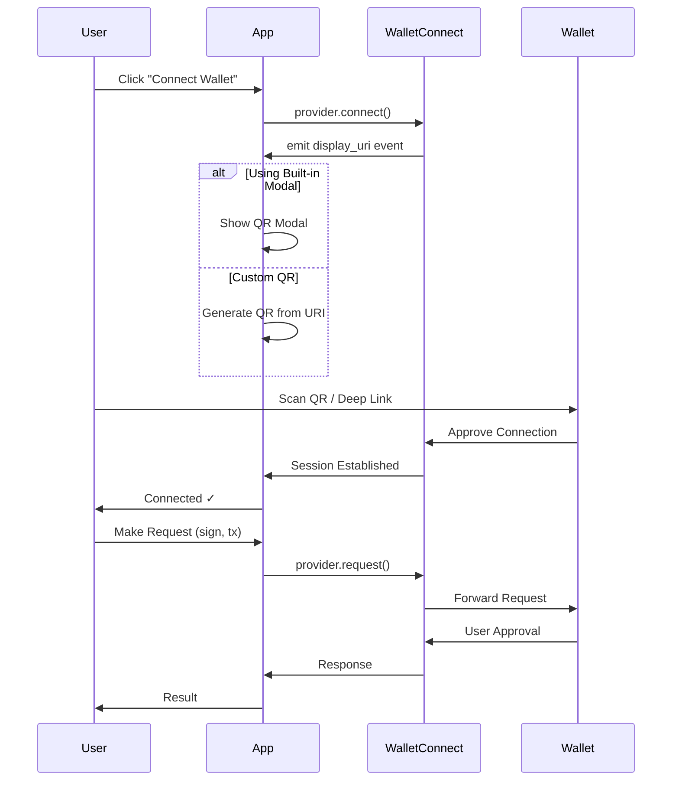

# WalletConnect Sign-In Integration Plan

## Overview

This plan outlines how to integrate WalletConnect as a wallet-based sign-in solution using `@walletconnect/ethereum-provider`.

## Package to Use

**`@walletconnect/ethereum-provider`** - Provides:
- EIP-1193 compliant Ethereum provider (works with web3.js, ethers.js)
- Built-in QR code modal (via `@reown/appkit`)
- Or custom QR code rendering via `display_uri` event
- SIWE (Sign-In with Ethereum) support via `authenticate()` method

## Installation

```bash
npm install @walletconnect/ethereum-provider
```

For QR code modal:
```bash
npm install @reown/appkit
```

---

## Integration Steps

### Step 1: Get WalletConnect Project ID

1. Go to [WalletConnect Cloud](https://cloud.walletconnect.com)
2. Create a new project
3. Copy the Project ID

---

### Step 2: Initialize the Provider

```typescript
import { EthereumProvider } from "@walletconnect/ethereum-provider";

const provider = await EthereumProvider.init({
  projectId: "YOUR_PROJECT_ID",
  chains: [1],                    // Required chains (Ethereum mainnet)
  optionalChains: [10, 137, 42161], // Optional chains (Optimism, Polygon, Arbitrum)
  showQrModal: true,              // Enable built-in QR modal
  methods: ["eth_sendTransaction", "personal_sign"],
  events: ["chainChanged", "accountsChanged"],
  metadata: {
    name: "Your App Name",
    description: "Description of your app",
    url: "https://your-app.com",
    icons: ["https://your-app.com/icon.png"]
  },
  qrModalOptions: {
    themeMode: "dark",
    // ... other AppKit options
  }
});
```

---

### Step 3: Handle Connection (Sign-In)

#### Option A: Using Built-in QR Modal

```typescript
// Connect triggers the QR modal automatically
await provider.connect();

// Or use enable() for simpler flow
const accounts = await provider.enable();
console.log("Connected accounts:", accounts);
```

#### Option B: Custom QR Code

```typescript
// Subscribe to URI event for custom QR code
provider.on("display_uri", (uri: string) => {
  // Generate QR code from URI using your preferred QR library
  console.log("WalletConnect URI:", uri);
  // Example: use qrcode library
  // QRCode.toCanvas(canvas, uri);
});

await provider.connect();
```

---

### Step 4: Handle Authentication (SIWE)

For Sign-In with Ethereum (authenticating the wallet address):

```typescript
// Using the authenticate method for SIWE
const result = await provider.authenticate({
  chains: [1],
  domain: "your-app.com",
  uri: "https://your-app.com/login",
  statement: "Sign in to Your App",
  nonce: "random-nonce",
});

// result contains:
// - session: the established session
// - auths: authentication info
// - signature: wallet signature for verification
```

---

### Step 5: Handle Events

```typescript
// Connection established
provider.on("connect", ({ chainId }) => {
  console.log("Connected to chain:", chainId);
});

// Account changes
provider.on("accountsChanged", (accounts) => {
  console.log("Accounts changed:", accounts);
  if (accounts.length === 0) {
    // User disconnected
  }
});

// Chain changes
provider.on("chainChanged", (chainId) => {
  console.log("Chain changed to:", chainId);
});

// Disconnect
provider.on("disconnect", (error) => {
  console.log("Disconnected:", error);
});
```

---

### Step 6: Make RPC Requests

```typescript
// Get accounts
const accounts = await provider.request({ method: "eth_accounts" });

// Request accounts (triggers connection if not connected)
const accounts = await provider.request({ method: "eth_requestAccounts" });

// Sign message
const signature = await provider.request({
  method: "personal_sign",
  params: [message, address]
});

// Send transaction
const txHash = await provider.request({
  method: "eth_sendTransaction",
  params: [{
    from: address,
    to: recipient,
    value: "0x..." // in hex
  }]
});
```

---

### Step 7: Use with Ethers.js / Web3.js

```typescript
// Ethers.js v6
import { ethers } from "ethers";
const ethersProvider = new ethers.BrowserProvider(provider);
const signer = await ethersProvider.getSigner();

// Web3.js
import Web3 from "web3";
const web3 = new Web3(provider);
```

---

### Step 8: Handle Disconnection

```typescript
await provider.disconnect();
```

---

### Step 9: Persist Session (Optional)

The provider automatically persists the session. On page reload:

```typescript
// Re-initialize provider with same options
const provider = await EthereumProvider.init({
  projectId: "YOUR_PROJECT_ID",
  chains: [1],
  optionalChains: [10, 137],
  showQrModal: true,
  metadata: { ... }
});

// Session is automatically restored
const accounts = await provider.request({ method: "eth_accounts" });
```

---

## Architecture Flow



---

## Full Example: React Component

```tsx
import { useEffect, useState } from "react";
import { EthereumProvider } from "@walletconnect/ethereum-provider";

const projectId = process.env.NEXT_PUBLIC_WALLETCONNECT_PROJECT_ID!;

let provider: Awaited<ReturnType<typeof EthereumProvider.init>> | null = null;

export default function WalletConnectButton() {
  const [account, setAccount] = useState<string | null>(null);
  const [connecting, setConnecting] = useState(false);

  useEffect(() => {
    initializeProvider();
  }, []);

  const initializeProvider = async () => {
    if (provider) return;

    provider = await EthereumProvider.init({
      projectId,
      optionalChains: [1, 10, 137, 42161],
      showQrModal: true,
      metadata: {
        name: "My App",
        description: "Sign in with Ethereum",
        url: "https://myapp.com",
        icons: ["https://myapp.com/icon.png"]
      }
    });

    provider.on("accountsChanged", (accounts) => {
      setAccount(accounts[0] || null);
    });

    provider.on("disconnect", () => {
      setAccount(null);
    });

    // Check for existing session
    if (provider.accounts.length > 0) {
      setAccount(provider.accounts[0]);
    }
  };

  const connect = async () => {
    if (!provider) return;
    setConnecting(true);
    try {
      await provider.connect();
      const accounts = await provider.request({ method: "eth_requestAccounts" });
      setAccount(accounts[0]);
    } catch (error) {
      console.error("Connection failed:", error);
    } finally {
      setConnecting(false);
    }
  };

  const disconnect = async () => {
    if (!provider) return;
    await provider.disconnect();
    setAccount(null);
  };

  return (
    <div>
      {!account ? (
        <button onClick={connect} disabled={connecting}>
          {connecting ? "Connecting..." : "Connect Wallet"}
        </button>
      ) : (
        <div>
          <p>Connected: {account}</p>
          <button onClick={disconnect}>Disconnect</button>
        </div>
      )}
    </div>
  );
}
```

---

## Key Configuration Options

| Option | Type | Description |
|--------|------|-------------|
| `projectId` | string | Required. Your WalletConnect project ID |
| `chains` | number[] | Required chains user must support |
| `optionalChains` | number[] | Additional chains user may support |
| `showQrModal` | boolean | Enable built-in QR modal |
| `methods` | string[] | RPC methods your app requires |
| `optionalMethods` | string[] | Optional RPC methods |
| `events` | string[] | Events your app requires |
| `optionalEvents` | string[] | Optional events |
| `rpcMap` | object | Custom RPC URLs per chain |
| `metadata` | object | Your app's metadata (name, url, icons) |
| `qrModalOptions` | object | Customization for QR modal |

---

## Common Chains (Chain IDs)

| Chain | Chain ID |
|-------|----------|
| Ethereum | 1 |
| Goerli (testnet) | 5 |
| Sepolia (testnet) | 11155111 |
| Optimism | 10 |
| Arbitrum One | 42161 |
| Polygon | 137 |
| Base | 8453 |
| BNB Chain | 56 |

---

## Next Steps for Your Project

1. Install `@walletconnect/ethereum-provider`
2. Get a Project ID from [WalletConnect Cloud](https://cloud.walletconnect.com)
3. Follow the integration steps above
4. Add session persistence if needed
5. Implement proper error handling
6. Test with multiple wallets
